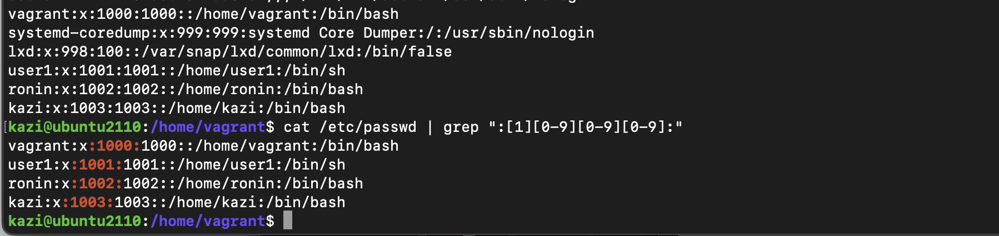

## Kazi

## Ans. 1
<pre>
sudo apt update
sudo apt upgrade
</pre>

## Ans. 2 
Click on the ]
Go to insert mode
Press r and K

in insert mode go to the second last line 
replace numbs with :digits:

## Ans. 3

open man pages 
- man journalctl 
- search by keywords boot, priority and json i.e. /boot /priority /json or scroll up and down using space and b 
- sudo journalctl -p err -b -o json-pretty

## Ans. 4
run the following commands in the given screenshot:

## Ans. 5

<pre>
!/bin/bash

function users(){
echo Regular users:

grep ':[1][0-9][0-9][0-9]:' /etc/passed

echo "Users logged in:"
who
}

display

display > /etc/motd
</pre>

## Ans. 5

- service files are located in /etc/systemd/system

<pre>
[Unit]
Description=list users and write to etc/motd

[Service]
Type=oneshot
ExecStart=/opt/find_users/find_users

[Install]
WantedBy=multi-user.target
</pre>

## Ans. 6

-Timer file will be as follows:

<pre>
[Unit]
Description=Timer to find users 

[Timer]
OnCalendar=*-*-* 05:00:00
Persistent=true

[Install]
WantedBy=timers.target
</pre>

