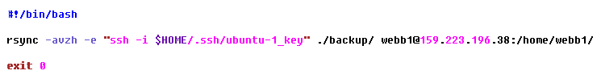
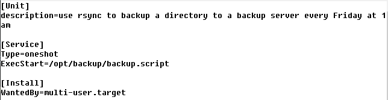
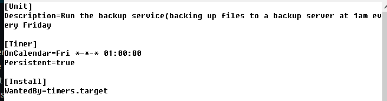

# rsync backup service

This is a service to back up files in a specific folder to a backup droplet every Friday at 1:00am

## Description

The service is personalized to my own droplets and my own ssh keys, so the application is not easily usable by others without major configuration. The application is very simple though and does not require much explanation:

The backup application uses the `rsync` function to back up every file in a specified backup folder to a specified folder of a backup droplet every Friday at 1:00am(GMT)

## Getting Started

### Dependencies

* This application was designed and tested on the most recent distribution of Ubuntu(as of Nov. 30th 2022) as used by DigitalOcean. In this, all dependencies are already satisfied

### Installing & Executing

* All files are personalized with ssh keys, ip addresses, and user names, so most of the files are not usable out of the box, and some configuration is necessary.
* The following three steps will cover how to set up 3 files: the script, the service, and the timer, with brief explanations of the purpose of each

#### backup script

Of the three files, the script is the most simple. The script is the last thing to be executed when this service runs, and it contains the actual core functionality of the service. Without this file, the service lacks it's ability to actually back up files.

Yours should look similar to this:
```
    #!/bin/bash

    rsync -avzh -e "ssh -i [path to ssh key]" [start directory] [user]@[host IP]:[desitnation directory]

    exit 0
```

for me, this script looks like this:


#### backup service

The backup service is responsible for specifying __how__ the service runs, with some parameters to determine just that. Unlike script, this file is not personalized to my own specific set of parameters, and can be adopted 1:1.

Your backup.service file should contain 3 sections:
* A `[Unit]` section, containing a description of what the service does(not mandatory, but good to include)
```
    [Unit]
    description=use rsync to back up a directory to a backup server every Friday
```

* A `[Service]` section specifying __how__ the service runs and __what__ file it executes
```
    [Service]
    Type=oneshot
    ExecStart=/opt/backup/backup.script
```
Type determines how the program runs, and `oneshot` here means that the program will deactivate right after it activates and completes it's task. ExecStart determines where the service looks for a file to run. In this case it needs to be looking for the script file.

* An `[Install]` section specifying when the service can start. In this case we're specifying that the service can only start up __after__ all other essential services
```
   [Install]
   WantedBy=multi-user.target 
```

for me, this script looks like this:


#### backup timer

The backup timer is responsible for specifying __when__ the service runs, with some parameters to determine just that. Similarly to service, this file is not personalized to my own specific set of parameters, and can be adopted 1:1.

Your baclup.timer file should contain 3 sections:
* A `[Unit]` section, containing a description of what the timer does(exact same function as the one in backup.service)
```
[Unit]
Description=Run the backup service at 1am every Friday
```

* A `[Timer]` section used to specifically specify when and how it will run.
```
[Timer]
OnCalendar=Fri *-*-* 01:00:00
Persistent=true
```
Persistence here basically means that if the machines are turned off when the timer passes it's threshhold, the backup will run at the next available opporttunity

* An `[Install]` section which determines when the timer gets started on boot(I think?)
```
WantedBy=timers.target
```
for me, this script looks like this:


Contributors:
* Mitchel Webb
* Kazi Wahedullah
